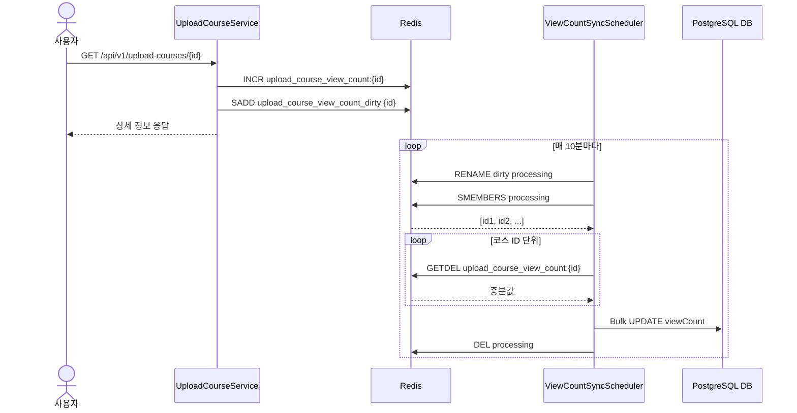

# TASK-5: Redis 조회수 카운터 및 스케줄러 동기화 로직 구현

## 개요
상세 조회 시 발생하던 DB 직접 `UPDATE` 부하를 줄이기 위해, **Redis에서 조회수를 증가(Counting)시키고 10분마다 DB에 일괄 반영(Write-Back)**하는 구조로 개선했습니다.

## 핵심 동작 흐름
1. **상세 조회 시**: Redis 키(`upload_course_view_count:{id}`) 값을 증가(`INCR`)시키고, 해당 ID를 Dirty Set(`upload_course_view_count_dirty`)에 기록합니다.
2. **10분 주기 동기화**:
   - `RENAME`으로 Dirty Set을 Processing Set으로 변경하여 동기화 중 유입되는 데이터와 분리(스냅샷)합니다.
   - Processing Set의 ID들을 순회하며 Redis 순정 `GETDEL` 명령어(`opsForValue().getAndDelete()`)로 조회수 증분값을 원자적으로 추출 및 삭제합니다.
   - 추출한 증분값들을 DB에 벌크 `UPDATE`로 일괄 반영 후 Processing Set을 삭제합니다.

## 시퀀스 다이어그램

