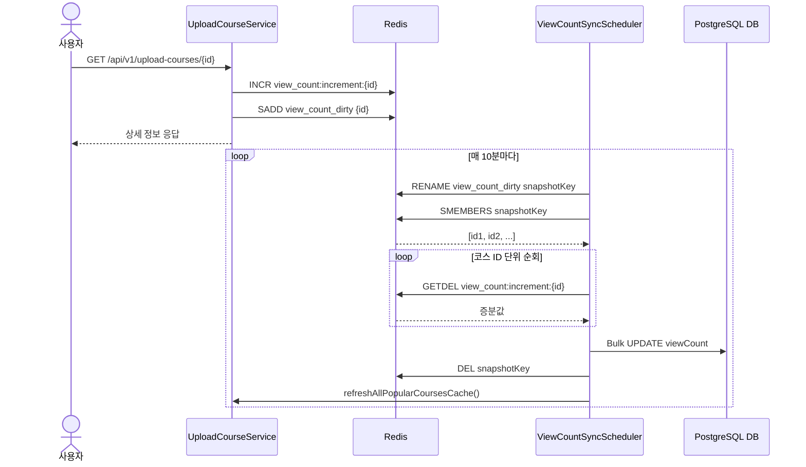

# TASK-5: Redis 조회수 카운터 및 스케줄러 동기화 로직 구현

## 개요
상세 조회 시 발생하던 DB 직접 `UPDATE` 락 경합 부하를 줄이기 위해, **Redis에서 조회수를 메모리 상에서 원자적으로 카운팅(Counting)하고 10분마다 DB에 일괄 반영(Write-Back)**하는 구조로 개선했습니다.

---

## 🔄 상세 동작 순서 (Step-by-Step)

### Phase 1. 실시간 조회수 카운팅 (상세 조회 API 호출 시)

1. **상세 조회 요청 유입**
   - 사용자가 `GET /api/v1/upload-courses/{id}` API를 호출합니다.
2. **Redis 카운터 증가 (`INCR`)**
   - `UploadCourseViewCountService`에서 해당 코스 ID의 카운터 키(`view_count:increment:{id}`) 값을 1 증가시킵니다.
3. **변경 대상 ID 기록 (`SADD`)**
   - DB에 동기화해야 할 코스 ID를 추적하기 위해 Dirty Set(`view_count_dirty`)에 코스 ID를 추가합니다. (Set 구조이므로 중복 자동 제거)
4. **장애 격리 (Fail-Open)**
   - Redis 연결 장애나 타임아웃이 발생하더라도 `try-catch`로 오류를 래핑하여 WARN 로그만 남기고, 사용자에게는 코스 상세 정보를 200 OK로 정상 응답합니다.

---

### Phase 2. 10분 주기 DB 동기화 및 랭킹 갱신 (스케줄러 실행 시)

1. **스케줄러 트리거**
   - `ViewCountSyncScheduler`가 매 10분마다(`@Scheduled(cron = "0 0/10 * * * *")`) 실행됩니다.
2. **동기화 대상 체크**
   - `view_count_dirty` 키가 존재하는지 확인하고, 없으면 즉시 종료합니다.
3. **스냅샷 격리 (`RENAME`)**
   - `view_count_dirty` Set의 이름을 UUID가 붙은 스냅샷 키(`view_count_dirty_snapshot_{uuid}`)로 변경(`RENAME`)합니다.
   - *이점*: 동기화 처리 중에 새롭게 유입되는 조회수 요청은 새로운 `view_count_dirty` Set에 쌓이게 되므로, 동시성 데이터 유실이나 락 경합이 발생하지 않습니다.
4. **대상 코스 ID 목록 조회 (`SMEMBERS`)**
   - `SMEMBERS snapshotKey` 명령어로 동기화 대상이 되는 코스 ID 목록 전체를 가져옵니다.
5. **원자적 증분값 추출 및 키 삭제 (`GETDEL`)**
   - 가져온 코스 ID를 순회하며 순정 `GETDEL` 커맨드(`opsForValue().getAndDelete(counterKey)`)를 실행합니다.
   - 카운팅된 조회수 증분값을 원자적으로 읽어옴과 동시에 Redis에서 해당 카운터 키를 즉시 삭제합니다.
6. **DB 벌크 증분 반영 (`UPDATE`)**
   - 읽어온 증분값이 0보다 큰 경우, `UploadCourseRepository.incrementViewCount(uploadCourseId, increment)`를 통해 DB에 `UPDATE UploadCourse SET viewCount = viewCount + :increment WHERE id = :id` 쿼리를 실행합니다.
7. **스냅샷 정리 및 랭킹 캐시 갱신 (Refresh-Ahead)**
   - 처리 완료 후 스냅샷 키를 삭제합니다.
   - DB의 조회수가 최신화되었으므로, `uploadCourseService.refreshAllPopularCoursesCache()`를 호출해 인기 코스 Top 5 랭킹 캐시를 최신 상태로 덮어씁니다(Refresh-Ahead).

---

## 📊 시퀀스 다이어그램

