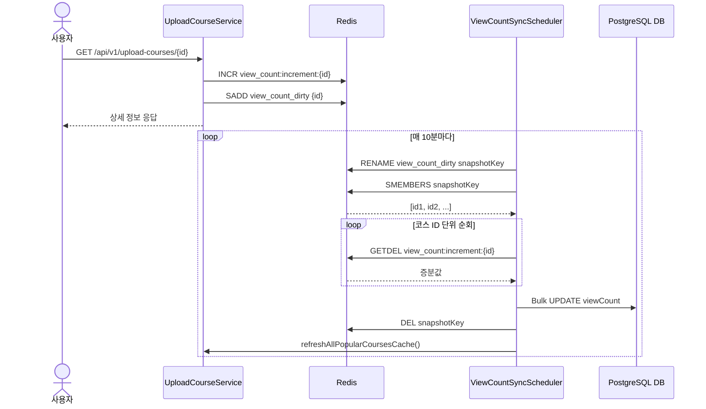

# TASK-5: Redis 조회수 카운터 및 스케줄러 동기화 로직 구현

## 개요
상세 조회 시 발생하던 DB 직접 `UPDATE` 락 경합 부하를 줄이기 위해, **Redis에서 조회수를 메모리 상에서 원자적으로 카운팅(Counting)하고 10분마다 DB에 일괄 반영(Write-Back)**하는 구조로 개선했습니다.

---

## 🔄 상세 동작 순서 (Step-by-Step)

### Phase 1. 실시간 조회수 카운팅 (상세 조회 API 호출 시)

1. **상세 조회 요청 유입**
   - 사용자가 `GET /api/v1/upload-courses/{id}` API를 호출합니다.
2. **Redis 카운터 증가 (`INCR`)**
   - `UploadCourseViewCountService`에서 해당 코스 ID의 카운터 키(`view_count:increment:{id}`) 값을 1 증가시킵니다.
3. **변경 대상 ID 기록 (`SADD`)**
   - DB에 동기화해야 할 코스 ID를 추적하기 위해 Dirty Set(`view_count_dirty`)에 코스 ID를 추가합니다. (Set 구조이므로 중복 자동 제거)
4. **장애 격리 (Fail-Open)**
   - Redis 연결 장애나 타임아웃이 발생하더라도 `try-catch`로 오류를 래핑하여 WARN 로그만 남기고, 사용자에게는 코스 상세 정보를 200 OK로 정상 응답합니다.

---

### Phase 2. 10분 주기 DB 동기화 및 랭킹 갱신 (스케줄러 실행 시)

1. **스케줄러 트리거**
   - `ViewCountSyncScheduler`가 매 10분마다(`@Scheduled(cron = "0 0/10 * * * *")`) 실행됩니다.
2. **동기화 대상 체크**
   - `view_count_dirty` 키가 존재하는지 확인하고, 없으면 즉시 종료합니다.
3. **스냅샷 격리 (`RENAME`)**
   - `view_count_dirty` Set의 이름을 UUID가 붙은 스냅샷 키(`view_count_dirty_snapshot_{uuid}`)로 변경(`RENAME`)합니다.
   - *이점*: 동기화 처리 중에 새롭게 유입되는 조회수 요청은 새로운 `view_count_dirty` Set에 쌓이게 되므로, 동시성 데이터 유실이나 락 경합이 발생하지 않습니다.
4. **대상 코스 ID 목록 조회 (`SMEMBERS`)**
   - `SMEMBERS snapshotKey` 명령어로 동기화 대상이 되는 코스 ID 목록 전체를 가져옵니다.
5. **원자적 증분값 추출 및 키 삭제 (`GETDEL`)**
   - 가져온 코스 ID를 순회하며 순정 `GETDEL` 커맨드(`opsForValue().getAndDelete(counterKey)`)를 실행합니다.
   - 카운팅된 조회수 증분값을 원자적으로 읽어옴과 동시에 Redis에서 해당 카운터 키를 즉시 삭제합니다.
6. **DB 벌크 증분 반영 (`UPDATE`)**
   - 읽어온 증분값이 0보다 큰 경우, `UploadCourseRepository.incrementViewCount(uploadCourseId, increment)`를 통해 DB에 `UPDATE UploadCourse SET viewCount = viewCount + :increment WHERE id = :id` 쿼리를 실행합니다.
7. **스냅샷 정리 및 랭킹 캐시 갱신 (Refresh-Ahead)**
   - 처리 완료 후 스냅샷 키를 삭제합니다.
   - DB의 조회수가 최신화되었으므로, `uploadCourseService.refreshAllPopularCoursesCache()`를 호출해 인기 코스 Top 5 랭킹 캐시를 최신 상태로 덮어씁니다(Refresh-Ahead).

---

## 📊 시퀀스 다이어그램

---

## 💡 발견한 개선점 및 트레이드오프 분석

### 조회수 스케줄러 `GETDEL` 파이프라이닝 도입 시의 트레이드오프
현재 `ViewCountSyncScheduler`는 `GETDEL`을 순차적으로 반복 실행하고 있습니다. 이를 `executePipelined`를 통해 한 번의 네트워크 I/O로 묶어서 처리할 경우 얻을 수 있는 이점과 리스크(트레이드오프)는 다음과 같습니다.

#### 1. 🚨 데이터 유실 리스크 (Partial Failure & Connection Drop) - 가장 치명적
- **순차 실행 (현재):** 한 건씩 `GETDEL`을 수행하고 곧바로 DB에 반영합니다. 중간에 서버 크래시가 발생하더라도 아직 읽지 않은 키들은 Redis에 남아 있어 다음 스케줄러 실행 시 재개할 수 있습니다. (유실 최소화)
- **파이프라이닝 적용 시:** 수많은 `GETDEL` 명령이 한 번에 서버로 전송되어 Redis 메모리에서 즉시 카운터가 삭제(DEL)됩니다. 만약 응답 리스트를 파싱하는 도중 네트워크가 끊기거나 Spring Boot 서버가 크래시(OOM, Pod 재시작 등)될 경우, Redis에서는 데이터가 모두 지워졌으나 DB에는 전혀 반영하지 못한 상태가 되어 **대규모 조회수 데이터 통째 유실**이 발생할 수 있습니다.

#### 2. Redis 서버 블로킹 및 응답 지연 (Latency Spike)
- 수백~수천 개의 `GETDEL` 명령이 소켓 버퍼에 한 번에 도달하면, 싱글 스레드인 Redis는 이 뭉치를 연속해서 처리하느라 바빠집니다. 이 짧은 순간 다른 실시간 요청(사용자의 캐시 조회 등) 처리가 블로킹(Blocking)되어 전체 시스템의 레이턴시 스파이크를 유발할 수 있습니다.

#### 3. Spring 서버 메모리 부하 (Client-side Memory)
- 파이프라이닝은 모든 응답을 받을 때까지 결과를 클라이언트(Spring)의 힙 메모리에 버퍼링해둡니다. `dirtyCourseIds`가 수만 개일 경우 전체 결과를 메모리에 올리면서 일시적인 부하나 OOM을 유발할 수 있습니다.

#### 4. DB 트랜잭션 롤백 시의 비가역성
- 데이터를 파이프라인으로 한 번에 읽어와 DB에 벌크 삽입(Batch Update)하는 구조를 취할 경우, DB 쪽에서 데드락 등으로 트랜잭션 롤백이 일어나면 DB는 원상복구되지만 Redis는 이미 데이터가 소실되어 복구가 불가능합니다.

**결론 및 추후 최적화 대안 (Chunking):**
백그라운드 동기화 스케줄러는 RTT 단축보다 **데이터 유실 방지(안정성)**가 훨씬 중요한 도메인입니다. 무작정 파이프라이닝으로 밀어넣는 것은 데이터 유실 위험이 크므로, 만약 속도 개선이 필요하다면 **100~500개 단위의 청크(Chunk)로 쪼개어 파이프라이닝과 DB 벌크 업데이트를 수행하는 방식**을 도입하여 리스크를 최소화하는 것이 좋습니다.
