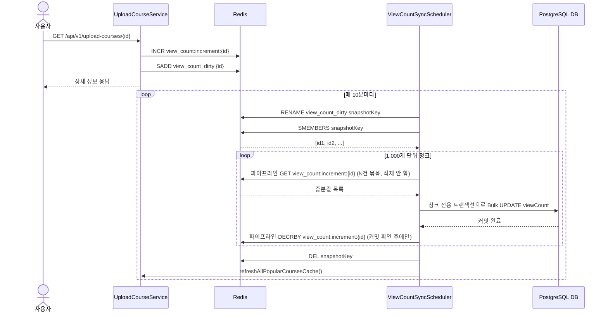

# TASK-5: Redis 조회수 카운터 및 스케줄러 동기화 로직 구현

## 개요
상세 조회 시 발생하던 DB 직접 `UPDATE` 락 경합 부하를 줄이기 위해, **Redis에서 조회수를 메모리 상에서 원자적으로 카운팅(Counting)하고 10분마다 DB에 일괄 반영(Write-Back)**하는 구조로 개선했습니다.

---

## 🔄 상세 동작 순서 (Step-by-Step)

### Phase 1. 실시간 조회수 카운팅 (상세 조회 API 호출 시)

1. **상세 조회 요청 유입**
   - 사용자가 `GET /api/v1/upload-courses/{id}` API를 호출합니다.
2. **Redis 카운터 증가 (`INCR`)**
   - `UploadCourseViewCountService`에서 해당 코스 ID의 카운터 키(`view_count:increment:{id}`) 값을 1 증가시킵니다.
3. **변경 대상 ID 기록 (`SADD`)**
   - DB에 동기화해야 할 코스 ID를 추적하기 위해 Dirty Set(`view_count_dirty`)에 코스 ID를 추가합니다. (Set 구조이므로 중복 자동 제거)
4. **장애 격리 (Fail-Open)**
   - Redis 연결 장애나 타임아웃이 발생하더라도 `try-catch`로 오류를 래핑하여 WARN 로그만 남기고, 사용자에게는 코스 상세 정보를 200 OK로 정상 응답합니다.

---

### Phase 2. 10분 주기 DB 동기화 및 랭킹 갱신 (스케줄러 실행 시)

1. **스케줄러 트리거**
   - `ViewCountSyncScheduler`가 매 10분마다(`@Scheduled(cron = "0 0/10 * * * *")`) 실행됩니다.
2. **동기화 대상 체크**
   - `view_count_dirty` 키가 존재하는지 확인하고, 없으면 즉시 종료합니다.
3. **스냅샷 격리 (`RENAME`)**
   - `view_count_dirty` Set의 이름을 UUID가 붙은 스냅샷 키(`view_count_dirty_snapshot_{uuid}`)로 변경(`RENAME`)합니다.
   - *이점*: 동기화 처리 중에 새롭게 유입되는 조회수 요청은 새로운 `view_count_dirty` Set에 쌓이게 되므로, 동시성 데이터 유실이나 락 경합이 발생하지 않습니다.
4. **대상 코스 ID 목록 조회 (`SMEMBERS`)**
   - `SMEMBERS snapshotKey` 명령어로 동기화 대상이 되는 코스 ID 목록 전체를 가져옵니다.
5. **청크 분할 및 파이프라인 읽기 (`GET`)**
   - 대상 ID를 1,000개 단위 청크로 나눕니다(`ViewCountSyncScheduler.SYNC_CHUNK_SIZE`).
   - 청크마다 `UploadCourseViewCountService.readPendingIncrements`가 `executePipelined`로 `GET view_count:increment:{id}`를 한 번의 왕복에 묶어 실행합니다. **GETDEL이 아닌 GET**이므로 이 시점에는 Redis 카운터가 지워지지 않습니다.
6. **청크별 독립 트랜잭션으로 DB 반영 (`UPDATE`)**
   - 읽어온 증분이 있으면 `UploadCourseService.applyViewCountIncrements(increments)`를 호출합니다. 이 메서드에만 `@Transactional`이 걸려 있어, 호출이 끝나는 시점에 그 청크의 `UPDATE UploadCourse SET viewCount = viewCount + :increment WHERE id = :id`가 독립적으로 커밋됩니다.
7. **커밋 확인 후 파이프라인 차감 (`DECRBY`)**
   - DB 커밋이 끝난 뒤에만 `UploadCourseViewCountService.clearSyncedIncrements`가 방금 읽은 값만큼 `DECRBY`를 파이프라인으로 실행합니다. `DEL`이 아니라 `DECRBY`를 쓰는 이유는 그 사이 새로 들어온 조회 증분을 보존하기 위해서입니다.
   - 한 청크가 실패해도 예외를 격리하고 다음 청크로 진행합니다. 실패한 청크는 DECRBY가 실행되지 않으므로 그 증분은 Redis에 남아 다음 조회 시 자연스럽게 재동기화됩니다(유실이 아니라 지연).
8. **스냅샷 정리 및 랭킹 캐시 갱신 (Refresh-Ahead)**
   - 모든 청크 처리 후 스냅샷 키를 삭제합니다.
   - DB의 조회수가 최신화되었으므로, `uploadCourseService.refreshAllPopularCoursesCache()`를 호출해 인기 코스 Top 5 랭킹 캐시를 최신 상태로 덮어씁니다(Refresh-Ahead).

> GETDEL 순차 처리에서 GET→DECRBY 2단계 + 청크 파이프라이닝으로 전환한 배경과 근거는 아래 [발견한 개선점 및 트레이드오프 분석](#-발견한-개선점-및-트레이드오프-분석) 섹션 참고.

---

## 📊 시퀀스 다이어그램



---

## 💡 발견한 개선점 및 트레이드오프 분석

### 조회수 스케줄러 `GETDEL` 파이프라이닝 도입 시의 트레이드오프
현재 `ViewCountSyncScheduler`는 `GETDEL`을 순차적으로 반복 실행하고 있습니다. 이를 `executePipelined`를 통해 한 번의 네트워크 I/O로 묶어서 처리할 경우 얻을 수 있는 이점과 리스크(트레이드오프)는 다음과 같습니다.

#### 1. 🚨 데이터 유실 리스크 (Partial Failure & Connection Drop) - 가장 치명적
- **순차 실행 (현재):** 한 건씩 `GETDEL`을 수행하고 곧바로 DB에 반영합니다. 중간에 서버 크래시가 발생하더라도 아직 읽지 않은 키들은 Redis에 남아 있어 다음 스케줄러 실행 시 재개할 수 있습니다. (유실 최소화)
- **파이프라이닝 적용 시:** 수많은 `GETDEL` 명령이 한 번에 서버로 전송되어 Redis 메모리에서 즉시 카운터가 삭제(DEL)됩니다. 만약 응답 리스트를 파싱하는 도중 네트워크가 끊기거나 Spring Boot 서버가 크래시(OOM, Pod 재시작 등)될 경우, Redis에서는 데이터가 모두 지워졌으나 DB에는 전혀 반영하지 못한 상태가 되어 **대규모 조회수 데이터 통째 유실**이 발생할 수 있습니다.

#### 2. Redis 서버 블로킹 및 응답 지연 (Latency Spike)
- 수백~수천 개의 `GETDEL` 명령이 소켓 버퍼에 한 번에 도달하면, 싱글 스레드인 Redis는 이 뭉치를 연속해서 처리하느라 바빠집니다. 이 짧은 순간 다른 실시간 요청(사용자의 캐시 조회 등) 처리가 블로킹(Blocking)되어 전체 시스템의 레이턴시 스파이크를 유발할 수 있습니다.

#### 3. Spring 서버 메모리 부하 (Client-side Memory)
- 파이프라이닝은 모든 응답을 받을 때까지 결과를 클라이언트(Spring)의 힙 메모리에 버퍼링해둡니다. `dirtyCourseIds`가 수만 개일 경우 전체 결과를 메모리에 올리면서 일시적인 부하나 OOM을 유발할 수 있습니다.

#### 4. DB 트랜잭션 롤백 시의 비가역성
- 데이터를 파이프라인으로 한 번에 읽어와 DB에 벌크 삽입(Batch Update)하는 구조를 취할 경우, DB 쪽에서 데드락 등으로 트랜잭션 롤백이 일어나면 DB는 원상복구되지만 Redis는 이미 데이터가 소실되어 복구가 불가능합니다.

**결론 및 추후 최적화 대안 (Chunking):**
백그라운드 동기화 스케줄러는 RTT 단축보다 **데이터 유실 방지(안정성)**가 훨씬 중요한 도메인입니다. 무작정 파이프라이닝으로 밀어넣는 것은 데이터 유실 위험이 크므로, 만약 속도 개선이 필요하다면 **100~500개 단위의 청크(Chunk)로 쪼개어 파이프라이닝과 DB 벌크 업데이트를 수행하는 방식**을 도입하여 리스크를 최소화하는 것이 좋습니다.

---

## ✅ 최종 결정: GET→DECRBY 2단계 + 청크 파이프라이닝 + 청크별 트랜잭션 분리

위 분석 이후 실무 사례를 추가로 조사하고([참고: GitLab `BufferedCounter`](https://gitlab.com/gitlab-org/gitlab/-/merge_requests/104936), [Redis 공식 파이프라이닝 문서](https://redis.io/docs/latest/develop/using-commands/pipelining/)), 다음 두 가지를 재검토해 최종 구현 방향을 확정했습니다.

### 기존 분석에서 보완/반박된 지점

1. **청크 크기의 근거를 "성능"이 아니라 "유실 상한 제한"으로 바꿨습니다.** Redis 공식 문서는 파이프라인 청크를 10,000개 단위로 권장하며, GETDEL 응답처럼 수 바이트짜리 값이면 클라이언트 메모리 부하도 실질적으로 미미합니다. 즉 100~500개라는 청크 크기를 "성능/메모리" 근거로 정당화하기는 어렵습니다. 대신 **"청크는 유실을 없애는 게 아니라 크래시 시 유실(또는 지연) 범위를 그 청크 크기만큼으로 제한하는 장치"**라는 점을 명확히 하고, 청크 크기는 1,000으로 조정했습니다.
2. **"청크로 쪼개면 유실이 안전해진다"는 명제 자체가 성립하지 않는다는 점을 확인했습니다.** GETDEL을 유지하는 한, 청크 크기와 무관하게 크래시 시점의 그 청크는 Redis에서는 이미 지워졌지만 DB 트랜잭션은 커밋되지 않아 그대로 유실됩니다. 유실을 **제거**하려면 청크 분할이 아니라 "삭제 시점을 DB 커밋 이후로 미루는 것" 자체가 필요합니다.

### 채택한 방식

- **`GETDEL` → `GET`(비파괴적 읽기) + `DECRBY`(보상 차감) 2단계로 전환**: Redis에서 즉시 확정적으로 지워지는 GETDEL 대신, 값을 읽기만 하고 DB 반영이 실제로 커밋된 뒤에만 그만큼을 차감합니다. `DEL`이 아니라 `DECRBY`를 쓰는 이유는, 그 사이 새로 들어온 조회 증분까지 함께 지워지는 것을 막기 위해서입니다(`DEL`을 쓰면 동시 INCR분이 조용히 사라집니다).
- **청크(1,000개) 단위 파이프라이닝**: `GET`과 `DECRBY` 각각을 청크 단위로 한 번의 네트워크 왕복에 묶어 처리합니다.
- **청크별 독립 트랜잭션 커밋**: 스케줄러 메서드 전체에 걸려 있던 `@Transactional`을 제거하고, 청크의 DB 반영을 별도 서비스 메서드(`UploadCourseService.applyViewCountIncrements`)로 분리해 그 메서드에만 `@Transactional`을 걸었습니다. 이렇게 해야 "그 청크의 DB 반영이 실제로 커밋된 뒤에만 DECRBY를 호출한다"는 순서가 보장됩니다 — 스케줄러 메서드를 통째로 트랜잭션으로 감싼 채로는 GET→DECRBY로 바꿔도 여전히 동일한 유실 창구가 재현됩니다.

### 트레이드오프

- 유실은 없어졌지만, DB 커밋 이후 DECRBY 실행 전에 스케줄러가 크래시하면 다음 주기에 같은 증분이 한 번 더 반영되는 **중복(과대 집계)** 가능성은 남습니다. 조회수는 정확히 맞을 필요가 없는 지표이므로, 유실(과소 집계)보다 이 쪽이 훨씬 저렴한 대가라고 판단했습니다.
- 한 청크가 DB 오류 등으로 실패해도 예외를 격리해 다음 청크로 계속 진행하며, 실패한 청크의 증분은 Redis에 남아 다음 조회 시 자연스럽게 재동기화됩니다(유실이 아니라 지연).
- **`GETDEL` 대비 새로 생긴 부작용 — 카운터 키가 삭제되지 않고 영구히 남음**: 실제 Redis/DB로 검증하는 과정에서 확인한 부분입니다. `DECRBY`는 값을 0으로 만들 뿐 키 자체를 지우지 않으므로, 한 번이라도 조회된 코스는 `view_count:increment:{id}` 키가 값 `0`인 채로 Redis에 영구히 남습니다(예전 `GETDEL`은 처리 후 키를 완전히 지웠습니다). `readPendingIncrements`가 0 이하 값을 걸러내므로 다음 동기화 대상에는 포함되지 않아 기능적으로는 무해하지만, 키 자체는 계속 존재합니다.
  - 이 프로젝트에서는 채택하지 않은 이유: 키 개수의 상한이 "역대 조회된 적 있는 코스 수"로 자연히 제한되고(유저 수·요청 수가 아니라 콘텐츠 수에 비례), 콘텐츠는 사람이 직접 만들어 업로드하는 만큼 규모가 크지 않아 메모리 영향이 무시할 수준입니다.
  - 완전히 없애려면 `DECRBY` 후 결과값이 0 이하일 때 `DEL`까지 원자적으로 수행하는 Lua 스크립트(`DECRBY`→조건부 `DEL`)를 파이프라인 안에서 실행하는 방법이 있지만, 이 정도 규모에서는 추가 복잡도 대비 이득이 작다고 판단해 채택하지 않았습니다.

### 구현 위치

- `UploadCourseViewCountService.readPendingIncrements` / `clearSyncedIncrements` — 파이프라인 GET/DECRBY
- `UploadCourseService.applyViewCountIncrements` — 청크별 독립 트랜잭션 커밋
- `ViewCountSyncScheduler.syncChunk` — 청크 분할 및 GET → DB 커밋 → DECRBY 순서 오케스트레이션

---

## 📊 Before/After 성능 실측 (대상 코스 10,000건)

`@SpringBootTest` 기반 임시 벤치마크로 `syncViewCountsToDb()` 단독 호출 구간의 소요 시간을 측정했다(HTTP API가 아닌 스케줄러 내부 메서드라 TASK-3/4의 Node.js 부하 스크립트 방식은 적용 불가 — 대신 정합성 검증에 쓴 것과 동일한 `@SpringBootTest` + 스톱워치 패턴 재사용). 실제 로컬 Redis(Docker)·Postgres에 코스 10,000건, 코스당 증분 3을 시딩하고 3회씩 반복 측정했다.

| 지표 | Before (GETDEL 순차) | After (GET+DECRBY 청크 파이프라이닝) | 개선 |
|---|---|---|---|
| Redis 왕복 횟수(이론치) | 10,000회 (코스당 1회) | 40회 (20청크 × GET/DECRBY 각 1회) | 약 250배 감소 |
| 소요 시간 1회차 | 14,817 ms | 6,333 ms | - |
| 소요 시간 2회차 | 11,462 ms | 4,204 ms | - |
| 소요 시간 3회차 | 11,070 ms | 3,797 ms | - |
| **중앙값** | **11,462 ms** | **4,204 ms** | **약 2.7배 (63% 단축)** |

### 결과 해석

- Redis 왕복 횟수는 이론상 250배(10,000 → 40) 줄었지만, 실제 소요 시간 개선은 2.7배에 그쳤다. 원인은 명확하다 — **DB 왕복 횟수가 Before/After 동일**하기 때문이다. `applyViewCountIncrements`도 결국 `incrementViewCount(id, increment)`를 코스마다 한 번씩 개별 호출하는 구조라(멀티로우 배치 SQL이 아님), DB 쪽은 여전히 10,000회 왕복이 발생한다. 이번 변경은 "Redis 구간"만 최적화한 것이고, 측정 결과가 그 사실을 정확히 보여준다.
- 1회차가 항상 2~3회차보다 느린 것은 JIT 워밍업, 커넥션 풀·Lettuce 채널 초기화 비용 때문으로 보인다(2~3회차부터 안정화).
- **추가 개선 여지(당시엔 범위 밖으로 남겼음, 아래 절에서 실제로 적용함)**: DB 쪽이 이제 지배적인 비용이므로, 여기서 더 줄이려면 `UPDATE ... FROM (VALUES ...)` 형태의 멀티로우 배치 UPDATE로 청크당 DB 왕복을 1,000회에서 1회로 줄이는 방안을 고려할 수 있다.

---

## ✅ 후속 결정: 청크당 DB 왕복을 네이티브 멀티로우 UPDATE로 1회로 통합

[이슈 #65](https://github.com/Kookmin-MoP-Yourtrip/YOURTRIP_BE/issues/65)에서 위 "추가 개선 여지"를 실제로 적용했다.

### 왜 `hibernate.jdbc.batch_size`가 아니었는가

가장 먼저 검토한 건 Hibernate의 `hibernate.jdbc.batch_size` 설정이었다. 하지만 이 설정은 **영속성 컨텍스트의 dirty-checking flush**(즉 `save()`/`persist()`로 관리되는 엔티티가 flush될 때 자동 생성되는 DML)에만 적용된다. `incrementViewCount`는 `@Modifying @Query`로 짠 커스텀 벌크 쿼리라 호출 즉시 `executeUpdate()`가 실행되며 flush 파이프라인을 거치지 않으므로, 이 설정을 켜도 지금 패턴에는 효과가 없다. 대안으로 "엔티티를 로드해서 수정 후 `saveAll`" 방식으로 전환하는 것도 검토했으나, 이 경우에도 왕복 횟수는 `N/batch_size`로 줄어들 뿐 "1회 보장"은 되지 않고, `order_updates` 설정이 빠지면 조용히 배치가 무효화되는 리스크가 있어 채택하지 않았다.

### 채택한 방식

[UploadCourseRepository.java](../../../../src/main/java/backend/yourtrip/domain/uploadcourse/repository/UploadCourseRepository.java)에 Postgres `unnest()`로 두 병렬 배열(ids, increments)을 행 집합으로 풀어 조인하는 네이티브 멀티로우 UPDATE를 추가했다:

```sql
UPDATE upload_course uc
SET view_count = uc.view_count + v.increment
FROM (SELECT unnest(:ids) AS id, unnest(:increments) AS increment) AS v
WHERE uc.upload_course_id = v.id
```

`UploadCourseService.applyViewCountIncrements`는 이제 청크 엔트리를 순회하는 루프 대신 이 쿼리를 1회 호출한다. 기존 단건 `incrementViewCount(id, increment)`는 호출부가 없어져 완전히 제거했다.

### 재측정 (대상 코스 10,000건, 동일 방법론)

| 지표 | Before (개별 UPDATE 루프) | After (멀티로우 UPDATE) | 개선 |
|---|---|---|---|
| 청크당 DB 왕복 횟수(이론치) | 1,000회 | 1회 | 1,000배 감소 |
| 소요 시간 1회차 | 6,932 ms | 2,293 ms | - |
| 소요 시간 2회차 | 4,916 ms | 1,614 ms | - |
| 소요 시간 3회차 | 3,813 ms | 2,042 ms | - |
| **중앙값** | **4,916 ms** | **2,042 ms** | **약 2.4배 (58% 단축)** |

`hibernate.SQL: debug` 로그로도 청크당 `UPDATE upload_course` 문장이 정확히 1번만 실행됨을 확인했다(기존에는 1,000번).

### 결과 해석

- DB 왕복은 이론상 1,000배 줄었는데 전체 소요 시간은 2.4배 개선에 그쳤다. Redis 파이프라이닝 때와 같은 패턴이다 — 왕복 횟수 감소가 곧바로 같은 배수의 시간 단축으로 이어지지 않는다. Postgres 입장에서 "행 1,000개를 개별 UPDATE 1,000번"과 "행 1,000개를 멀티로우 UPDATE 1번"은 네트워크 왕복 수는 크게 다르지만, DB 서버 내부에서 실제로 1,000개 행을 찾아 잠그고 갱신하는 작업량 자체는 비슷하기 때문으로 보인다. 즉 이번 최적화로 없앤 건 "네트워크 RTT 누적 비용"이지 "행 갱신 자체의 비용"이 아니다.
- 그럼에도 이 최적화의 핵심 가치는 절대 시간 단축보다 **커넥션 점유 시간 단축**에 있다. 기존에는 청크 하나를 처리하는 동안 HikariCP 커넥션 하나를 1,000번의 순차 왕복 내내(수 초) 붙잡고 있었는데, 이제는 SQL 한 문장을 보내고 응답을 기다리는 훨씬 짧은 시간만 붙잡는다. 실제 트래픽과 겹칠 때 커넥션 풀 경합 위험을 줄인다는 점에서, 이번 변경은 "스케줄러를 더 빠르게" 만들었다기보다 "스케줄러가 다른 요청에 주는 부담을 줄였다"는 관점에서 더 의미가 있다.
